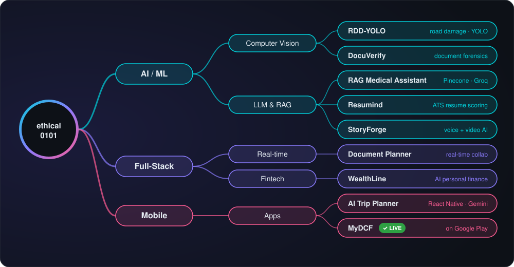
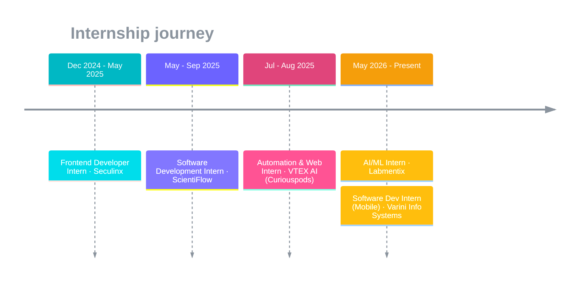

<!-- ═══════════════════════════════════════════════════════════════════ -->
<!--                    DRUTHENDRA KOMMI · ethical0101                    -->
<!-- ═══════════════════════════════════════════════════════════════════ -->

<div align="center">

<!-- Hero banner: vivid gradient that reads well on light and dark themes -->


<a href="https://git.io/typing-svg">
  
</a>

<br/><br/>

<a href="https://portfolio-phi-nine-70.vercel.app/"></a>
<a href="https://www.linkedin.com/in/kommidruthendra/"></a>
<a href="mailto:kommidruthendra2005@gmail.com"></a>
<a href="https://x.com/Druthendra"></a>
<a href="https://leetcode.com/ethical0101"></a>

<br/>


</div>

<br/>

<!-- ─────────────────────────── WHOAMI ─────────────────────────── -->

```ts
// ~/ethical0101/whoami.ts

const druthendra = {
  location:   "India 🇮🇳",
  education:  "Integrated M.Tech · VIT Vellore",
  currently:  ["AI/ML Intern @ Labmentix", "Mobile SDE Intern @ Varini Info Systems"],
  shipped:    ["MyDCF — React Native fintech app, live on Google Play 🚀"],
  building:   ["Computer-vision pipelines", "RAG systems"],
  stack:      { ai: ["PyTorch", "YOLO", "LangChain", "Gemini"], web: ["Next.js", "React", "FastAPI"], mobile: ["React Native", "Expo"] },
  philosophy: "Ship fast. Break limits. Repeat.",
  askMeAbout: ["object detection", "real-time collab", "LLM integrations", "shipping MVPs at hackathons"],
} as const;
```

<!-- ─────────────────────── FLAGSHIP PROJECTS ─────────────────────── -->

##  Flagship Projects

<!-- Spotlight: published app -->
<table>
<tr>
<td width="100%">

### 📱 MyDCF &nbsp;
**A React Native financial app, built end to end and published on the Google Play Store**

From idea to a production release: app architecture, UI, testing, signing and the Play Store review process. It's the project where everything I build for the web and with AI came together in an app real users can install.


<a href="https://play.google.com/store/apps/details?id=com.mydcf&pli=1"></a>

</td>
</tr>
</table>

<table>
<tr>
<td width="50%" valign="top">

### 🛣️ RDD-YOLO
**Road damage detection, geolocation & mapping**

Detects potholes and cracks with a YOLO26 / RDD-YOLO model trained on **RDD2022 + 9 public datasets**, reaching **62.45% mAP@50**. Detections are geotagged and plotted on OpenStreetMap. Inference also runs **entirely in the browser** with ONNX Runtime Web.


[**Live Demo →**](https://ethical0101.github.io/RDD-YOLO/) · [Repo](https://github.com/ethical0101/RDD-YOLO)

</td>
<td width="50%" valign="top">

### 🔍 DocuVerify
**Explainable AI for document forensics**

Flags manipulated identity and educational documents by combining several signals: OCR, image anomaly detection and ML classifiers. Every verdict comes with human-readable evidence, not just a score.


[**Live Demo →**](https://docuverify-6wjf.onrender.com/) · [Repo](https://github.com/ethical0101/DocuVerify)

</td>
</tr>
<tr>
<td width="50%" valign="top">

### 📝 Document Planner
**Real-time collaborative workspace (Notion-style)**

A block editor with workspaces, live multi-user presence, threaded comments, @mentions and notifications. It has been tested with 10 concurrent editors and cut version conflicts by 60%.


[**Live Demo →**](https://document-planner.vercel.app/) · [Repo](https://github.com/ethical0101/Document-Planner)

</td>
<td width="50%" valign="top">

### 🩺 RAG Medical Assistant
**Ask questions across clinical PDFs**

A Retrieval-Augmented Generation pipeline. Medical documents are chunked, embedded with Gemini and stored in Pinecone. LangChain orchestrates retrieval, and Groq-hosted LLMs return fast, grounded answers.


[**Live Demo →**](https://rag-medical-assistant15.streamlit.app/) · [Repo](https://github.com/ethical0101/RAG-Medical-Assistant)

</td>
</tr>
<tr>
<td width="50%" valign="top">

### 💰 WealthLine
**AI personal finance + software-metrics engine**

A personal finance app built with React and Express, using JWT auth. It runs a Bayesian risk network and three-method correlation analysis, and turns the results into Gemini-generated financial recommendations.


[**Live Demo →**](https://wealthline-eight.vercel.app) · [Repo](https://github.com/ethical0101/Personal-Finance-Management-System)

</td>
<td width="50%" valign="top">

### 📄 Resumind
**AI resume analyzer & ATS scorer**

Parses resumes in the browser with PDF.js and scores them for ATS fit and relevance. Feedback on tone, structure and skills comes back through a strict prompt-to-JSON schema. Benchmarked against 100+ job descriptions.


[**Live Demo →**](https://ai-resume-analyzer-136-p6pbk.puter.site/) · [Repo](https://github.com/ethical0101/Ai-Resume-Analyzer)

</td>
</tr>
</table>

<details>
<summary><b>📦 More builds — mobile, AI storytelling & early projects</b></summary>
<br/>

| Project | What it is | Stack |
|:--|:--|:--|
| ✈️ [AI Trip Planner](https://github.com/ethical0101/AI-Trip-Planner) | Mobile itinerary generator with Maps route optimization. Tested by 200+ users. | React Native · Expo · Gemini · Google Maps |
| 🎭 [StoryForge](https://github.com/ethical0101/StoryForge) | AI storytelling with voice and video generation | React · Supabase · Gemini · ElevenLabs · Tavus |
| 🎵 [Music Player](https://github.com/ethical0101/Music-Player) | Streaming app with playlists — my first Django project | Django · SQLite |
| 🎬 [MovieLand](https://github.com/ethical0101/MovieLand) | Movie discovery with debounced search | React · OMDB API |

</details>

<!-- ─────────────────────── HOW I BUILD ─────────────────────── -->

## 🧭 How My Projects Connect

<div align="center">
  
</div>

<!-- ─────────────────────── EXPERIENCE ─────────────────────── -->

## 💼 Experience Timeline



<!-- ─────────────────────── TECH STACK ─────────────────────── -->

## 🛠️ Toolbox

<div align="center">

| Domain | Tools |
|:--:|:--|
| **Languages** |  |
| **AI / ML** |  &nbsp; `YOLO` `ONNX` `LangChain` `Pinecone` `Gemini` `Groq` |
| **Frontend** |  |
| **Mobile** |  &nbsp; `React Native` `Expo` |
| **Backend & Data** |  |
| **Cloud & DevOps** |  |

</div>

<!-- ─────────────────────── STATS ─────────────────────── -->

## 📊 By the Numbers

<div align="center">

<picture>
  <source media="(prefers-color-scheme: dark)" srcset="https://github-readme-stats.vercel.app/api?username=ethical0101&show_icons=true&theme=tokyonight&hide_border=true&bg_color=00000000&title_color=00F7FF&icon_color=FF4B91&text_color=c9d1d9&rank_icon=github&include_all_commits=true"/>
  
</picture>
<picture>
  <source media="(prefers-color-scheme: dark)" srcset="https://github-readme-stats.vercel.app/api/top-langs/?username=ethical0101&layout=compact&theme=tokyonight&hide_border=true&bg_color=00000000&title_color=00F7FF&text_color=c9d1d9&langs_count=8"/>
  
</picture>

<picture>
  <source media="(prefers-color-scheme: dark)" srcset="https://streak-stats.demolab.com?user=ethical0101&theme=tokyonight&hide_border=true&background=00000000&ring=00F7FF&fire=FF4B91&currStreakLabel=00F7FF"/>
  
</picture>


</div>

<!-- ─────────────────────── ACHIEVEMENTS ─────────────────────── -->

## 🏆 Certifications & Wins

<div align="center">


<br/>


</div>

<!-- ─────────────────────── NOW ─────────────────────── -->

## 🔭 Right Now

<table>
<tr>
<td>

- 🧪 **Experimenting with** edge inference: YOLO on WebGPU and ONNX in the browser
- 🚀 **Just shipped** MyDCF to the Google Play Store, now iterating on user feedback
- 🧠 **Learning** applied ML pipelines and LLM evaluation
- 🤝 **Open to** SWE / AI-ML internships, collaborations and open source

</td>
<td align="center">

<br/>
<b>Say hi!</b><br/>
<sub>kommidruthendra2005@gmail.com</sub>
</td>
</tr>
</table>

<!-- ─────────────────────── FOOTER ─────────────────────── -->

<div align="center">

<picture>
  <source media="(prefers-color-scheme: dark)" srcset="https://raw.githubusercontent.com/ethical0101/ethical0101/output/github-contribution-grid-snake-dark.svg"/>
  
</picture>

<br/>


</div>
